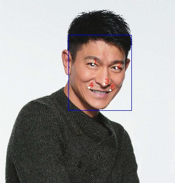
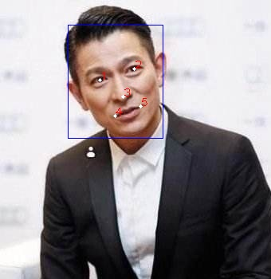

# **seetaFace python api(两行逻辑代码完成人脸识别)**

## 1. 简介

项目基于`SeetaFace2` 封装的python接口,使用简便,性能与原始c++模块基本一致,实测相较于开源的`facenet` 和 `dlib` 在国内人脸识别的准确率上要明显更好,为此特意封装了python模块,方便小伙伴们快速上手使用,觉得有帮助给个 **star** 吧！

`SeetaFace2` 人脸识别引擎包括了搭建一套全自动人脸识别系统所需的三个核心模块，即：人脸检测模块 `FaceDetector`、面部关键点定位模块 `FaceLandmarker` 以及人脸特征提取与比对模块 `FaceRecognizer`。还将陆续开源人脸跟踪、闭眼检测等辅助模块。

与 2016 年开源的 `SeetaFace 1.0` 相比，`SeetaFace2` 在速度和精度两个层面上均有数量级的提升。

### 支持平台/python版本

| 版本 | window | Linux | 测试 |
:----: | :----: |:----: |:----: |
| python2.7 | √	| ×| 未测试 |
| python3.5 | √	| √| 已测试 |
| python3.6 | √	| ×| 已测试 |
| python3.7 | √	| ×| 已测试 |


## 2. 模型下载
- 人脸检测模块 FaceDetector 模型下载链接：  
MD5     ：E88669E5F1301CA56162DE8AEF1FD5D5  
百度网盘：https://pan.baidu.com/s/1Dt0M6LXeSe4a0Pjyz5ifkg 提取码：fs8r  
Dropbox : https://www.dropbox.com/s/cemt9fl48t5igfh/fd_2_00.dat?dl=0

-  面部特征5点定位模块 FaceLandmarker 模型下载链接：  
MD5     ：877A44AA6F07CB3064AD2828F50F261A  
百度网盘：https://pan.baidu.com/s/1MqofXbmTv8MIxnZTDt3h5A 提取码：7861  
Dropbox : https://www.dropbox.com/s/noy8tien1gmw165/pd_2_00_pts5.dat?dl=0

- 人脸特征提取和比对模块 FaceRecognizer 模型下载链接：  
MD5     ：2D637AAD8B1B7AE62154A877EC291C99  
百度网盘：https://pan.baidu.com/s/1y2vh_BHtYftR24V4xwAVWg 提取码：pim2  
Dropbox : https://www.dropbox.com/s/6aslqcokpljha5j/fr_2_10.dat?dl=0

&ensp;&ensp;&ensp;&ensp;下载上述3个模型，并将模型文件放入`models`目录下

## 3. 运行示例
### 3.1 运行依赖

&ensp;&ensp;&ensp;&ensp;示例依赖 `opencv` ,安装`opencv`(若已有cv2模块则忽略)

```key
    pip install -i https://pypi.tuna.tsinghua.edu.cn/simple opencv-python
``` 

### 3.2 快速演示demo

```key
    cd  seetaFacePython
```
&ensp;&ensp;`linux`下则需要添加库路径
```shell script
    export LD_LIBRARY_PATH=$LD_LIBRARY_PATH:`pwd`/SeetaFacePy/lib/linux
``` 

```key
    python simple_demo.py
    >> similar:0.9033384323120117
``` 

### 3.3 完整演示demo

```key
    python complete_demo.py
 
``` 

<div align=center>
     
     
</div>

欢迎开发者加入 SeetaFace QQ交流群


